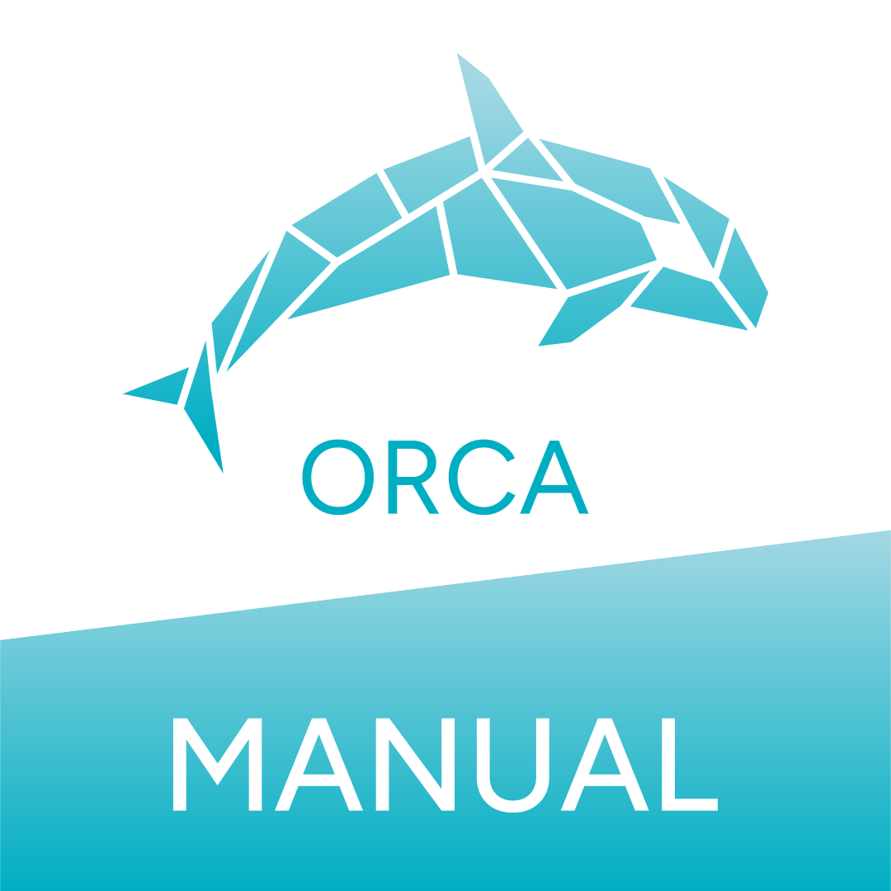
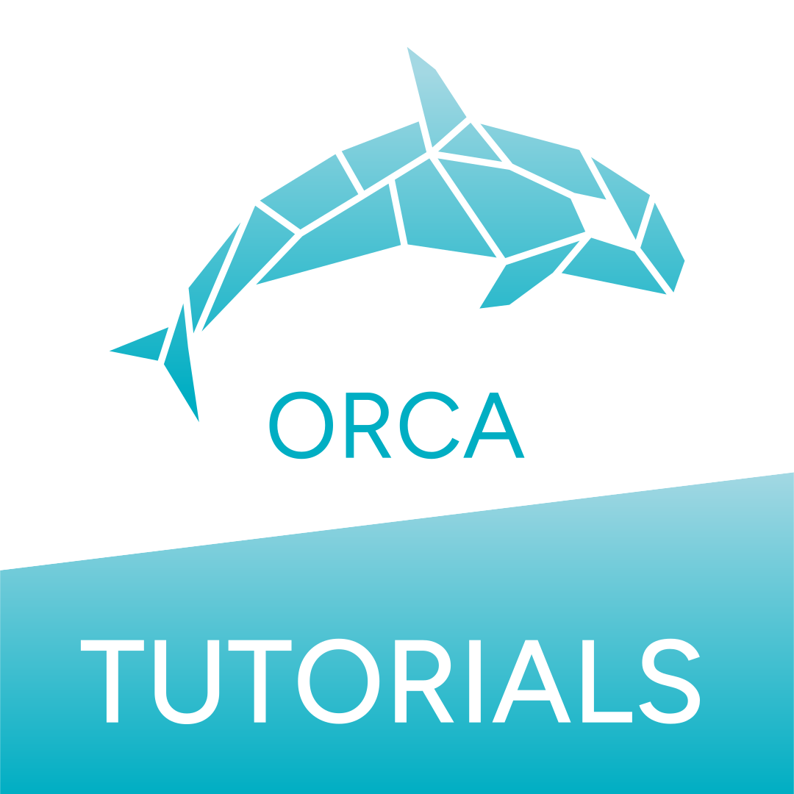

```{image} img/assets/opi_logo_horizontal.svg
:align: center
:alt: ORCA Python Interface
:width: 500
```

# ORCA Python Interface (OPI)

Here you will find tutorials on how to use the ORCA Python Interface (OPI). As it is meant to access features of the
[ORCA](https://www.faccts.de/orca/) quantum chemistry program package, we recommend to also check the
[ORCA manual](https://www.faccts.de/docs/orca/6.0/manual) to learn about the methods implemented in ORCA.
We also recommend to join the [ORCA forum](https://orcaforum.kofo.mpg.de/app.php/portal) where you can get some help
regarding individual and known issues with ORCA itself.

## Useful Links

::::{grid} 3
:::{grid-item-card}
[](../contents/api/index)
:::
:::{grid-item-card}
[](https://www.faccts.de/docs/orca/6.1/manual/)
:::
:::{grid-item-card}
[](https://www.faccts.de/docs/orca/6.1/tutorials/)
:::
::::
::::{grid} 3
:::{grid-item-card}
[](https://www.faccts.de/docs/opi/1.0/docs/contents/notebooks/how_to_opi.html)
:::
:::{grid-item-card}
[](https://pypi.org/project/orca-pi/)
:::
:::{grid-item-card}
[](https://github.com/faccts/opi)
:::
::::

```{toctree}
:caption: Documentation
:maxdepth: 2

contents/install
contents/api/index
```

```{toctree}
:caption: Development
:maxdepth: 1

contents/how_to_contribute
contents/dev_guide
```

```{toctree}
:caption: Tutorials
:maxdepth: 1

contents/notebooks/how_to_opi.ipynb
contents/notebooks/ml_properties.ipynb
contents/notebooks/conformer_generation.ipynb
contents/notebooks/fock_matrix_diagonalization.ipynb
contents/notebooks/led.ipynb
contents/notebooks/covaled_ethane.ipynb
contents/notebooks/adld_dftd4.ipynb
contents/notebooks/adld_hfld.ipynb
contents/notebooks/atomic_fukui_indices.ipynb
contents/notebooks/ir_spectrum.ipynb
```

```{toctree}
:caption: Community Examples
:maxdepth: 1

contents/notebooks/how_to_opi.ipynb
```

[documentation]: index.html
[tricks and tips]: index.html
